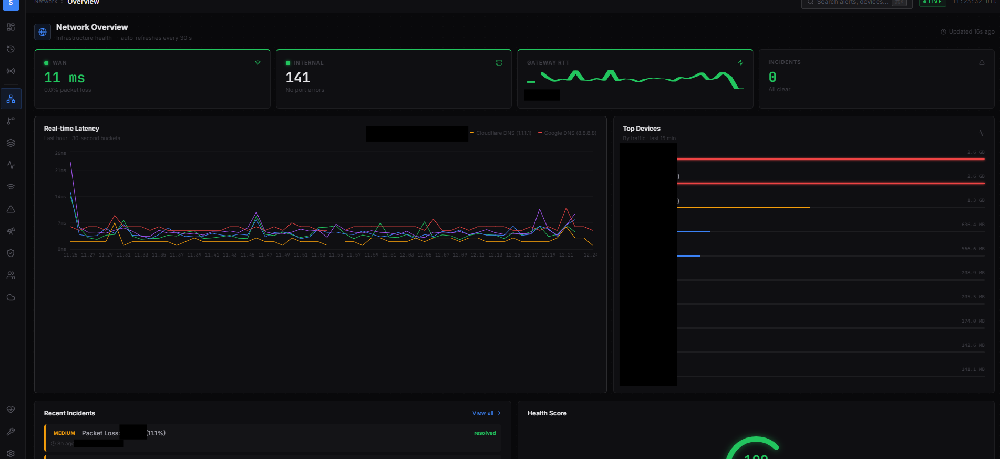
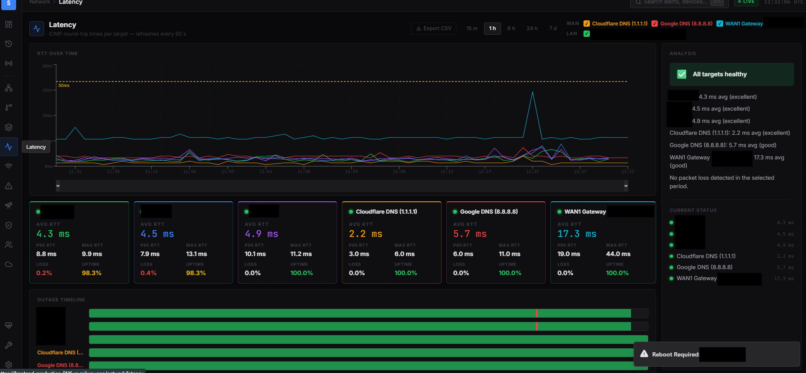
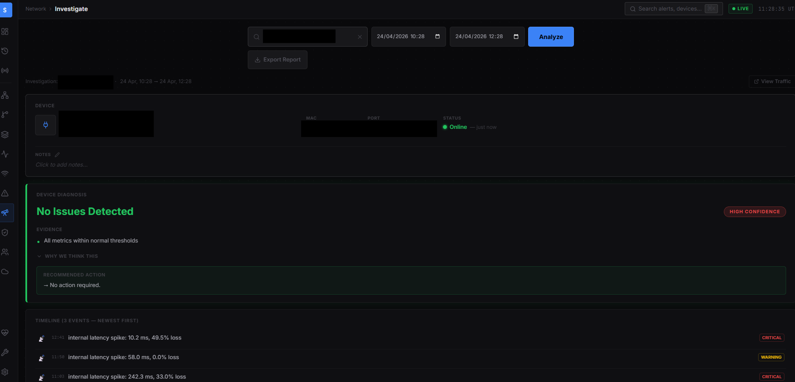

# STAR Alert System



Built this because the company I work for — a regulated financial services firm — had no real visibility into its own network. Alerts came from users complaining. I wanted to change that.

STAR is a full-stack network monitoring platform I designed and built from scratch as the sole IT engineer. It watches the WAN, the LAN, switches, endpoints, Active Directory, and Microsoft 365 — and surfaces everything through a single dashboard with real-time WebSocket updates and Telegram/email notifications.

---

## What it actually does

The system is split into two parts with a hard architectural boundary between them.

An on-premise collector runs inside the LAN as a Docker Compose stack. It uses fping to ping internal IPs every 30 seconds, polls UniFi Controller every 2 minutes for switch port stats and connected clients, and sends heartbeats every 60 seconds to confirm it's alive. If the backend is unreachable — say during a WAN outage — it writes everything to a local SQLite buffer and flushes in batches once connectivity returns. Up to 50,000 rows, 24 hours of data, no gaps.

The backend runs on Railway in EU West (Amsterdam) and handles everything the collector can't: WAN monitoring, root cause classification, alert deduplication, integrations, and the API itself. Keeping WAN checks in the cloud means they stay accurate even if pfSense is the problem.

---

## Root cause classification

When something goes wrong on the network, the system doesn't just say "something is down." It runs through a decision tree every 60 seconds and assigns one of six global root causes:

- `FULL_OUTAGE` — pfSense itself is unreachable
- `WAN_ISP` — both uplinks are down, ISP-level problem
- `WAN_LINE` — line-level issue detected
- `WAN1_DOWN` / `WAN2_DOWN` — individual gateway failure
- `ALL_INTERNAL` — all internal targets are down simultaneously

One open incident per root cause. If the same condition fires again before resolution, it deduplicates rather than creating noise. Device-level incidents (`DEVICE_OFFLINE`, `interface_error`, `traffic_anomaly`) use `{category}:{affected_ip}` as the dedup key.



---

## Stack

**Backend** — FastAPI on Railway, PostgreSQL on Supabase, SQLAlchemy ORM, Alembic migrations (29 applied), 15 routers, WebSocket broadcaster, background task loop.

**Frontend** — React + Vite + Tailwind, also on Railway. Communicates via REST and WebSocket. All HTTP calls go through a single `api.ts` module.

**Collector** — Docker Compose, runs on-premise. Python services: fping_collector, unifi_poller, health_reporter, goflow2_parser. SQLite write-ahead buffer with 20-second flush interval.

**Integrations** — NinjaRMM (OAuth + HMAC webhooks), UniFi Cloud API, Azure AD (Microsoft Graph), Microsoft 365 health, PingPlotter webhooks, Telegram bot, SMTP email.

---

## Frontend pages

Dashboard, alert history, and a full network section: WAN/LAN overview, device registry, switch port metrics with delta counters, RTT latency charts, open/closed incidents, per-device drill-down, alert thresholds config, NinjaRMM patch compliance, Azure AD user monitor, and M365 service health. Plus system pages for DB stats, source status, and maintenance windows.



---

## Real-time

WebSocket pushes four event types to connected clients: `alert.new`, `alert.updated`, `stats.update` (every 30 seconds), and `source.status_change`. Auth is via query param (`?api_key=`) because browser WebSocket API doesn't support custom headers. Stats broadcaster and source checker run as persistent background tasks in the FastAPI lifespan.

---

## Why I built it this way

The collector being fully offline-capable was a deliberate decision. A monitoring system that loses data during the exact event you're trying to capture is useless. The SQLite buffer solves that. The architectural split between on-premise and cloud monitoring solves a subtler problem: you can't trust LAN-based checks to tell you whether your WAN is up — the numbers look fine from inside the network even when the internet is gone.

The root cause classification came from frustration with alert floods. When WAN1 goes down, you don't want 40 device alerts — you want one incident that explains why. The dedup logic and consecutive-count guards keep the signal clean.

---

## Running it

The collector is the only part that runs on your hardware. Everything else is cloud-hosted.

```bash
# Collector (on-premise)
cd collector
cp .env.example .env  # fill in BACKEND_URL, COLLECTOR_SECRET, UniFi creds
docker compose up -d
```

Backend and frontend deploy automatically to Railway on push. Environment variables required: `DATABASE_URL`, `API_SECRET_KEY`, `COLLECTOR_SECRET`, gateway IPs, and whichever integrations you want active (Telegram, NinjaRMM, Azure, UniFi Cloud). Everything integration-related is optional — the core monitoring works without any of them.

---

## Status

Actively used in production. Migrations through 0027 are applied. Two pending: packet loss category (0028) and traceroute results storage (0029). NetFlow via goflow2 is collected but the Traffic page is currently disabled pending a UI decision on how to present flow data usefully rather than just dumping it.
